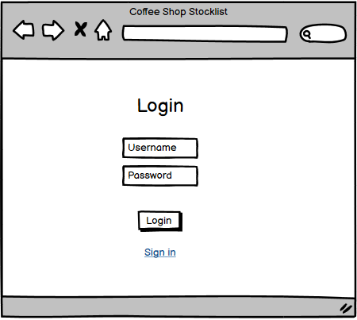
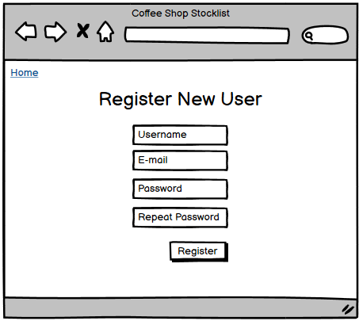
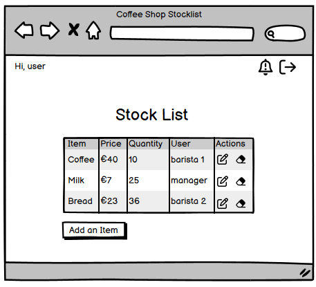
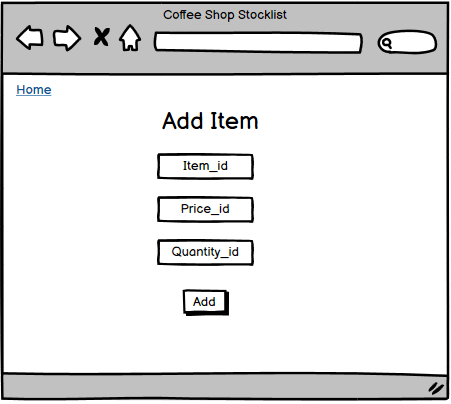
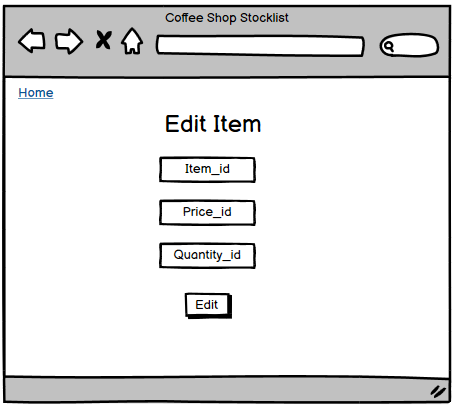
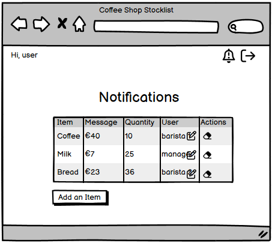
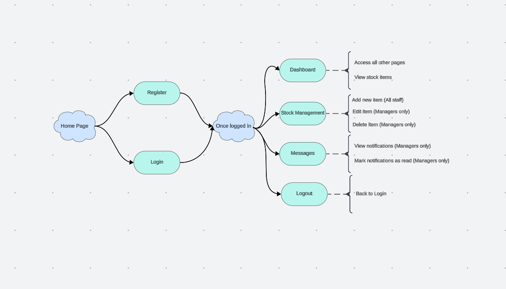

# Cabare Stocklist - Coffee Shop Stocklist Management app

## About
This application is designed to streamline inventory management for coffee shops, making it easy to keep track of stock levels, manage orders, and ensure the business never run out of essential supplies.
Whether it's a small boutique coffee shop or a large chain, Cabare Stocklist App is here to help manages inventory efficiently and effectively. 
Say goodbye to the stress of unexpected stock shortages and hello to a well-organized, smoothly running coffee shop.

The live website on Heroku can be accessed through following [link.](https://cabare-stocklist-bandj-64bab33316f2.herokuapp.com/)

## UX
The project is a coffee shop stocklist application. Utilizing Django, JavaScript, HTML, and CSS, it showcases my programming proficiency in developing dynamic and interactive web applications.

## Content
* [User Stories](#user-stories)
    * [User Login](#user-login)
    * [User Registration](#user-registration)
    * [View Stock Item List](#view-stock-item-list)
    * [Add New Stock Item](#add-new-stock-item)
    * [Edit Stock Item](#edit-stock-item)
    * [Delete Stock Item](#delete-stock-item)
    * [View Notifications](#view-notifications)
    * [Mark Notification as Read](#mark-notification-as-read)
    * [User Logout](#user-logout)
* [Wireframes](#wireframes)
    * [Login](#wireframe-of-the-login-page)
    * [Register](#wireframe-of-the-user-registration-page)
    * [Home](#wireframe-of-the-home-page)
    * [Add](#wireframe-of-the-add-new-item-page)
    * [Edit](#wireframe-of-the-edit-item-page)
    * [Notifications](#wireframe-of-the-notifications-page)
* [Flow Chart Overview](#flowchart-overview)
* [Technologies Used](#technologies-used)
    *[Languages Used](#languages-used)
    *[Frameworks and Tools Utilized](#frameworks-and-tools-utilized)
* [Setup]
* [Testing]
* [Bugs]
* [Credits]
* [Acknowledgements]

## User Stories
### User Login
As a barista or manager I can log in using my username and password so that I can access my account and manage the coffee shop stock.

### User Registration
As a barista or manager I can register an account with a username, email, and password so that I can access the coffee shop stock list system.

### View Stock Item List
As a barista or manager I can view a list of all stock items so that I can see all items at a glance.

### Add New Stock Item
As a barista or manager I can add new stock items so that I can keep track of all items needed for future orders.

### Edit Stock Item
As a manager I can edit stock item details so that I can update the list information as needed.

### Delete Stock Item
As a manager I can delete a stock item from the list so that I can remove items that are no longer needed.

### View Notifications
As a manager I can view all notifications so that I can keep track of items that need attention.

### Mark Notification as Read
As a manager I can mark notifications as read so that I can keep track of which notifications I have already addressed.

### User Logout
As a barista or manager I can log out of my account so that I can ensure my account is secure when not in use.

## Wireframes
To create the wireframes I used [Balsamic](https://balsamiq.com/). It helped me visualize the design before I started to build the website.
#### Wireframe of the login page

#### Wireframe of the user registration page

#### Wireframe of the home page

#### Wireframe of the add new item page

#### Wireframe of the edit item page

#### Wireframe of the notifications page


## Flowchart Overview
The flowchart represents the navigation and functionality structure for the web application. 
The chart was designed to provide a clear understanding of user interactions and access controls within the application. 
Distinguishing between general staff and managerial roles.
This structure aims to streamline navigation and enhance user experience while maintaining security and role-specific access control.


## Technologies Used
 
### Languages Used
* [HTML5](https://developer.mozilla.org/en-US/docs/Web/HTML)
* [CSS3](https://developer.mozilla.org/en-US/docs/Web/CSS/CSS_selectors)
* [JavaScript](https://developer.mozilla.org/en-US/docs/Web/JavaScript)
* [Python](https://developer.mozilla.org/en-US/docs/Glossary/Python)

### Frameworks and Tools Utilized
* [Django](https://developer.mozilla.org/en-US/docs/Learn/Server-side/Django)
Django served as the primary Python framework for developing this project.

* [Bootstrap](https://getbootstrap.com/)
Bootstrap was employed to manage the general layout and spacing of the website.

* [Neon](https://neon.tech/)
Neon was utilized for the production database.

* [Git](https://www.gitpod.io/)
Version control was managed using Git, with changes being committed and pushed to GitHub through the Gitpod terminal.

* [GitHub](https://github.com/)
The project's codebase was stored on GitHub after being pushed from Git.

* [Heroku](https://www.heroku.com/)
Heroku was used for deploying the application.

* [Balsamiq](https://balsamiq.com/)
Balsamiq was used to create wireframes for the site.

* [Lucidchart Flowchart](https://www.lucidchart.com/)
Lucidchart was used to create flowchart for the site.

* [Stack Overflow](https://stackoverflow.com/) and [Django Forum](https://forum.djangoproject.com/)
Stack Overflow and Django Forum were frequently consulted to resolve challenging code issues.

* [Nu Html Checker](https://validator.w3.org/nu/)
Nu Html Checker was used to validate the HTML code for the site.

* [W3C Validation Service](https://jigsaw.w3.org/css-validator/)
W3C Validation Service was used to validate CSS code for the site.

* [JS Hint](https://jshint.com/)
JS Hint was used to validate JavaScript code for the site.

* [CI Python Linter](https://pep8ci.herokuapp.com/)
CI Python Linter was used to validate the Python code of the site.

## Setup

### Django
1. Create Repository from Code Institute Template
Start by creating the repository using the Code Institute template. 
This template helps streamline the setup process by including pre-configured settings and files tailored for Code Institute projects.

2. Install Django
Next, you need to install Django. Use the following command to ensure you install a compatible version of Django:
```pip3 install 'django<4'
```
This command will install the latest version of Django that is less than version 4.

3. Create Django Project
Once Django is installed, you can create your new Django project. Execute the following command to initialize your project:
```django-admin startproject <django_bandj>
```

### NEON 


