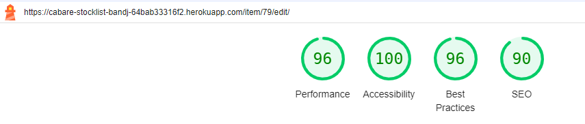
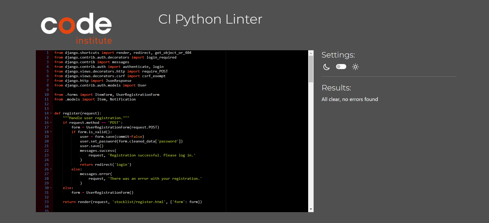

# Cabare Stocklist - Coffee Shop Stocklist app

## About
This application is designed to streamline inventory management for coffee shops, making it easy to keep track of stock levels, manage orders, and ensure the business never run out of essential supplies.
Whether it's a small boutique coffee shop or a large chain, Cabare Stocklist App is here to help manages inventory efficiently and effectively. 
Say goodbye to the stress of unexpected stock shortages and hello to a well-organized, smoothly running coffee shop.

The live website on Heroku can be accessed through following [link.](https://cabare-stocklist-bandj-64bab33316f2.herokuapp.com/)

## UX
The project is a coffee shop stocklist application. Utilizing Django, JavaScript, HTML, and CSS, it showcases my programming proficiency in developing dynamic and interactive web applications.

## Content
* [User Stories](#user-stories)
    * [User Login](#user-login)
    * [User Registration](#user-registration)
    * [View Stock Item List](#view-stock-item-list)
    * [Add New Stock Item](#add-new-stock-item)
    * [Edit Stock Item](#edit-stock-item)
    * [Delete Stock Item](#delete-stock-item)
    * [View Notifications](#view-notifications)
    * [Mark Notification as Read](#mark-notification-as-read)
    * [User Logout](#user-logout)
* [Wireframes](#wireframes)
    * [Login](#wireframe-of-the-login-page)
    * [Register](#wireframe-of-the-user-registration-page)
    * [Home](#wireframe-of-the-home-page)
    * [Add](#wireframe-of-the-add-new-item-page)
    * [Edit](#wireframe-of-the-edit-item-page)
    * [Notifications](#wireframe-of-the-notifications-page)
* [Flow Chart Overview](#flowchart-overview)
* [Technologies Used](#technologies-used)
    * [Languages Used](#languages-used)
    * [Frameworks and Tools Utilized](#frameworks-and-tools-utilized)
* [Setup](#setup)
    * [Django](#django)
    * [NEON](#neon)
    * [Whitenoise](#whitenoise)
    * [Deployment](#deploying-to-heroku)
* [Features](#features)
    * [Login Page](#login-page)
    * [Register Page](#register-page)
    * [Home Page](#home-page)
    * [Add Item Page](#add-item-page)
    * [Notifications Page](#notifications-page)
* [Features Left to Implement](#features-left-to-implement)
* [Testing and Validation](#testing-and-validation)
* [Bugs](#bugs)
* [Acknowledgements](#acknowledgements)

## User Stories
### User Login
As a barista or manager I can log in using my username and password so that I can access my account and manage the coffee shop stock.

### User Registration
As a barista or manager I can register an account with a username, email, and password so that I can access the coffee shop stock list system.

### View Stock Item List
As a barista or manager I can view a list of all stock items so that I can see all items at a glance.

### Add New Stock Item
As a barista or manager I can add new stock items so that I can keep track of all items needed for future orders.

### Edit Stock Item
As a manager I can edit stock item details so that I can update the list information as needed.

### Delete Stock Item
As a manager I can delete a stock item from the list so that I can remove items that are no longer needed.

### View Notifications
As a manager I can view all notifications so that I can keep track of items that need attention.

### Mark Notification as Read
As a manager I can mark notifications as read so that I can keep track of which notifications I have already addressed.

### User Logout
As a barista or manager I can log out of my account so that I can ensure my account is secure when not in use.

## Wireframes
To create the wireframes I used [Balsamic](https://balsamiq.com/). It helped me visualize the design before I started to build the website.
#### Wireframe of the login page

#### Wireframe of the user registration page

#### Wireframe of the home page

#### Wireframe of the add new item page

#### Wireframe of the edit item page

#### Wireframe of the notifications page


## Flowchart Overview
The flowchart represents the navigation and functionality structure for the web application. 
The chart was designed to provide a clear understanding of user interactions and access controls within the application. 
Distinguishing between general staff and managerial roles.
This structure aims to streamline navigation and enhance user experience while maintaining security and role-specific access control.


## Technologies Used
 
### Languages Used
* [HTML5](https://developer.mozilla.org/en-US/docs/Web/HTML)
* [CSS3](https://developer.mozilla.org/en-US/docs/Web/CSS/CSS_selectors)
* [JavaScript](https://developer.mozilla.org/en-US/docs/Web/JavaScript)
* [Python](https://developer.mozilla.org/en-US/docs/Glossary/Python)

### Frameworks and Tools Utilized
* [Django](https://developer.mozilla.org/en-US/docs/Learn/Server-side/Django)
Django served as the primary Python framework for developing this project.

* [Bootstrap](https://getbootstrap.com/)
Bootstrap was employed to manage the general layout and spacing of the website.

* [MDBootstrap](https://mdbootstrap.com/)
MDBootstrap was utilized to design the templates for the login page and the navbar. 

* [Neon](https://neon.tech/)
Neon was utilized for the production database.

* [Git](https://www.gitpod.io/)
Version control was managed using Git, with changes being committed and pushed to GitHub through the Gitpod terminal.

* [GitHub](https://github.com/)
The project's codebase was stored on GitHub after being pushed from Git.

* [Heroku](https://www.heroku.com/)
Heroku was used for deploying the application.

* [Balsamiq](https://balsamiq.com/)
Balsamiq was used to create wireframes for the site.

* [Lucidchart Flowchart](https://www.lucidchart.com/)
Lucidchart was used to create flowchart for the site.

* [Stack Overflow](https://stackoverflow.com/) and [Django Forum](https://forum.djangoproject.com/)
Stack Overflow and Django Forum were frequently consulted to resolve challenging code issues.

* [Nu Html Checker](https://validator.w3.org/nu/)
Nu Html Checker was used to validate the HTML code for the site.

* [W3C Validation Service](https://jigsaw.w3.org/css-validator/)
W3C Validation Service was used to validate CSS code for the site.

* [JS Hint](https://jshint.com/)
JS Hint was used to validate JavaScript code for the site.

* [CI Python Linter](https://pep8ci.herokuapp.com/)
CI Python Linter was used to validate the Python code of the site.

## Setup

### Django
1. Create Repository from Code Institute Template
Start by creating the repository using the Code Institute template. 
This template helps streamline the setup process by including pre-configured settings and files tailored for Code Institute projects.

2. Install Django
Next, you need to install Django. Use the following command to ensure you install a compatible version of Django:
```pip3 install 'django<4'```
This command will install the latest version of Django that is less than version 4.

3. Create Django Project
Once Django is installed, you can create your new Django project. Execute the following command to initialize your project:
```django-admin startproject <django_bandj>```

### NEON 
1. Install Neon:
```pip3 install neon```


2. Setup Neon:
Configure your settings to connect to your env.py file which will hold Neon's syntax for environment-based configuration.

* settings.py
```import os

if os.path.isfile('env.py'):
    import env
```

* env.py
```import os

os.environ['DATABASE_URL'] = '<Database-URL>'
os.environ['SECRET_KEY'] = '<create_your_secret_key>'
```

### Whitenoise
Whitenoise is a library that helps serve static files in your Django application. 
It allows your web application to handle static files (like CSS, JavaScript, and images) efficiently without needing a separate web server.

* To install Whitenoise:
    ```bash
    pip3 install whitenoise
    ```

* To configure Whitenoise:
    Add `'whitenoise.middleware.WhiteNoiseMiddleware'` to the `MIDDLEWARE` array in your `settings.py` file:
    ```python
    MIDDLEWARE = [
        # Other middleware classes
        'whitenoise.middleware.WhiteNoiseMiddleware',
    ]
    ```

* Set up static file handling in `settings.py`:
    ```python
    STATIC_URL = '/static/'
    STATIC_ROOT = os.path.join(BASE_DIR, 'staticfiles')
    ```

* Final steps:

* Collect static files:
    This command gathers all static files from your apps and places them in the directory specified by `STATIC_ROOT`.
    ```bash
    python manage.py collectstatic
    ```

* Run migrations:
    This command applies any database migrations.
    ```bash
    python manage.py migrate
    ```

* Launch the Django development server:
    This command starts the development server so you can see your changes.
    ```bash
    python manage.py runserver
    ```


### Deploying to Heroku
* **Create the Heroku app**
1. Log in to your Heroku account;
2. Click the New button in the top right corner;
3. Choose a name for your project. This must be unique. Select the region closest to you. Confirm by clicking Create app.

* **Create a database**
Code Institute recommends creating an account with ElephantSQL for database management. 
However, ElephantSQL has announced on their homepage that they will be going offline in January 2025. 
As a result, I created an account with [Neon](https://neon.tech/) instead.

* **Connecting the database to our app**
1. in Heroku, go to the Settings tab;
2. Click Reveal Config Vars;
3. Add a Config Var called DATABASE_URL. Paste your database URL in as the value.

* **Deploy Your App on Heroku**
1. Navigate to the Deploy Tab
   - In your Heroku dashboard, select your app.
   - Go to the "Deploy" tab in the app's dashboard.

2. **Connect to GitHub**
   - Under the "Deployment method" section, choose "GitHub".
   - Click on the "Connect to GitHub" button.
   - If prompted, authorize Heroku to access your GitHub account.
   - Search for the repository you want to deploy and click "Connect".

3. **Deploy Your Branch Manually**
   - Scroll down to the "Manual deploy" section.
   - Ensure the "main" branch is selected (or choose the branch you want to deploy).
   - Click on the "Deploy Branch" button.
   - Wait for the deployment process to complete.

4. **Verify the Deployment**
   - Once the app is successfully deployed, a confirmation message will appear.
   - Click on the "View" button to open your app and verify that it’s running correctly.


## Features

### Login Page
The login page allows users to sign in to access the inventory management features of the application.
**Username and Password Input:** Users can enter their username and password to authenticate.
**Remember Me Option:** Users have the option to stay logged in across sessions with a "Remember Me" checkbox.

The page dynamically displays error or success messages based on the login attempt's outcome.
**Error Messages:** Displayed in red to alert users of invalid login attempts or other issues.
**Success Messages:** Displayed in green to notify users of successful actions.

Users who do not have an account can easily navigate to the registration page via a provided link.


### Register Page
The register page allows new users to create an account to access the inventory management features of the application.
**Username, Email, and Password Input**: Users can enter their username, email address, password, and confirm their password to register.

The page dynamically displays error or success messages based on the registration attempt's outcome.
**Error Messages:** Displayed in red to alert users of invalid inputs or other registration issues.
**Success Messages:** Displayed in green to notify users of successful registration.


## Home Page
The home page displays the list of items available in the inventory of the application.
**Item List Display:** Shows a table of items with details including name, price, quantity, and the user who added the item.
Actions for Managerial Members: Managerial embers have options to edit or delete items and view the low stock alert notifications.

The page dynamically displays error or success messages based on actions taken on the items.
**Error Messages:** Displayed in red to alert users of issues.
**Success Messages:** Displayed in green to notify users of successful actions.


## Add Item Page
The add item page allows users to input details of a new item to be added to the inventory of the application.

**Item Details Input**: Users can enter the name, price, and quantity of the new item.

The page dynamically displays error or success messages based on the item addition attempt's outcome.
**Error Messages:** Displayed in red to alert users of invalid inputs or other issues.
**Success Messages:** Displayed in green to notify users of successful item addition.


## Notifications Page
The notifications page displays a list of notifications related to the inventory management activities of the application.

**Notification Details Display:** Shows a table of notifications with details including item name, message, creation date, status, and an action to mark notifications as read.

The page dynamically displays the notifications if available, and provides feedback on their status.


## Features Left to Implement
### Password Recovery
* Implement a feature that allows users to recover their passwords in case they forget them. This feature should include secure methods for verifying user identity and resetting the password.
    * Priority: High
    * Status: Not Started

### Enable Purchase Order Generation
* Develop functionality to allow users to generate and manage purchase orders. 
This should include the ability to create new purchase orders, track the status of existing orders, and integrate with inventory management.
    * Priority: Medium
    * Status: Not Started

### Stock Level Reporting
* Create detailed stock level reporting features. 
This should include real-time stock levels, historical stock data, and alerts for low stock levels.
    * Priority: Medium
    * Status: Not Started

### Search and Filter Functionality
* Implement comprehensive search and filter capabilities throughout the application. 
Users should be able to search and filter data based on various criteria to easily find specific information.
    * Priority: High
    * Status: Not Started

## Testing and Validation
To ensure the quality and standards compliance of the project, the following tools and validators were used:

**HTML Validation**
To validate the HTML of the project, I used the W3C Nu HTML Checker. 
You can validate your HTML files by entering the URL of your web pages in the tool.

* [Login](https://validator.w3.org/nu/?doc=https%3A%2F%2Fcabare-stocklist-bandj-64bab33316f2.herokuapp.com%2Flogin%2F%3Fnext%3D%2F)
* [Register](https://validator.w3.org/nu/?doc=https%3A%2F%2Fcabare-stocklist-bandj-64bab33316f2.herokuapp.com%2Fregister%2F)
* [Home](https://validator.w3.org/nu/?doc=https%3A%2F%2Fcabare-stocklist-bandj-64bab33316f2.herokuapp.com%2Fhome%2F)
* [Add Item](https://validator.w3.org/nu/?doc=https%3A%2F%2Fcabare-stocklist-bandj-64bab33316f2.herokuapp.com%2Fadd%2F)
* [Edit Item](https://validator.w3.org/nu/?doc=https%3A%2F%2Fcabare-stocklist-bandj-64bab33316f2.herokuapp.com%2Fitem%2F76%2Fedit%2F)
* [Notifications](https://validator.w3.org/nu/?doc=https%3A%2F%2Fcabare-stocklist-bandj-64bab33316f2.herokuapp.com%2Fnotifications%2F)

**CSS Validation**
For CSS validation, I utilized the W3C CSS Validator. 
This tool checks for proper syntax and adherence to CSS standards. 

* [Login](https://jigsaw.w3.org/css-validator/validator?uri=https%3A%2F%2Fcabare-stocklist-bandj-64bab33316f2.herokuapp.com%2Flogin%2F%3Fnext%3D%2F&profile=css3svg&usermedium=all&warning=1&vextwarning=&lang=en)
* [Register](https://jigsaw.w3.org/css-validator/validator?uri=https%3A%2F%2Fcabare-stocklist-bandj-64bab33316f2.herokuapp.com%2Fregister%2F&profile=css3svg&usermedium=all&warning=1&vextwarning=&lang=en)
* [Home](https://jigsaw.w3.org/css-validator/validator?uri=https%3A%2F%2Fcabare-stocklist-bandj-64bab33316f2.herokuapp.com%2Fhome%2F&profile=css3svg&usermedium=all&warning=1&vextwarning=&lang=en)
* [Add Item](https://jigsaw.w3.org/css-validator/validator?uri=https%3A%2F%2Fcabare-stocklist-bandj-64bab33316f2.herokuapp.com%2Fadd%2F&profile=css3svg&usermedium=all&warning=1&vextwarning=&lang=en)
* [Edit Item](https://jigsaw.w3.org/css-validator/validator?uri=https%3A%2F%2Fcabare-stocklist-bandj-64bab33316f2.herokuapp.com%2Fitem%2F79%2Fedit%2F&profile=css3svg&usermedium=all&warning=1&vextwarning=&lang=en)
* [Notifications](https://jigsaw.w3.org/css-validator/validator?uri=https%3A%2F%2Fcabare-stocklist-bandj-64bab33316f2.herokuapp.com%2Fnotifications%2F&profile=css3svg&usermedium=all&warning=1&vextwarning=&lang=en)

**Performance and Best Practices**
To assess the performance, accessibility, best practices, and SEO of the web application, I used Google Lighthouse, available in the Chrome DevTools. 
This tool provides comprehensive insights and recommendations for improving web performance and user experience.





**JavaScript Validation**
For JavaScript code validation, I used JSHint. 
This tool helps identify potential problems in JavaScript code and ensures adherence to coding standards.


**Python (Django) Code Validation**
To validate Python code, particularly for Django, I used the PEP8 online checker. 
This tool checks the code against PEP8 standards to ensure readability and maintainability:





*By using these tools and validators, I ensured that the project adheres to web standards, follows best practices, and maintains high-quality code.*

## Bugs
***Dangerous Site Warning***
Users may see a "Dangerous Site" warning when visiting the deployed app using Google Chrome, indicating potential security risks. 
This warning page suggests that the site might trick users into installing malicious software or revealing sensitive information like passwords or credit card numbers.


Users can proceed by clicking on "Details" and then "Proceed anyway" or similar options, depending on the browser. 

**Additional Information:**
I sought help from Slack and tutor support, and they couldn't find anything wrong with my code. 
This issue only occurs in Google Chrome. You can see the website by clicking "Details" and "Proceed anyway."
I am actively working on resolving this bug and will provide updates accordingly.

## Acknowledgements
* Thank you to my mentor Rory Sheridan for the amazing support and tips.
* Thank you to my fiance and friends that helped me in the hard moments throughout the project.


